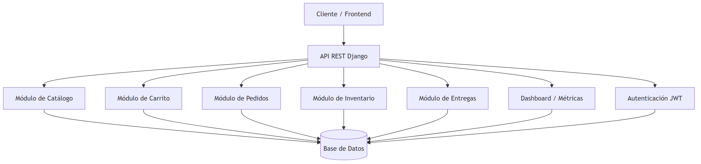

# Daybed

Este proyecto es una aplicación full-stack para una tienda de muebles. Utiliza **Django** y **Django REST Framework** en el backend, y **React** con **Vite** en el frontend. Seguimos el estándar de equipo utilizando `uv` para la gestión de dependencias y entorno de Python.

---

## Requisitos previos

Antes de comenzar, asegúrate de tener instalado lo siguiente:

* **Node.js LTS**: [Descargar Node.js](https://nodejs.org/)

* **Git**: [Instalar Git](https://git-scm.com/downloads)

* **Visual Studio Code**: recomendado para trabajar con las extensiones del proyecto.

* **uv**: [Instalar uv](https://github.com/astral-sh/uv)

  ```powershell
  powershell -ExecutionPolicy ByPass -c "irm https://astral.sh/uv/install.ps1 | iex"
  ```

  Si PowerShell no reconoce `uv` después de instalarlo, agrega temporalmente la ruta de uv a la sesión actual:

  ```powershell
  $env:Path = "$env:USERPROFILE\.local\bin;$env:Path"
  ```

  Para guardar esa ruta de forma permanente en las variables de entorno del usuario:

  ```powershell
  [Environment]::SetEnvironmentVariable("Path", $env:USERPROFILE + "\.local\bin;" + [Environment]::GetEnvironmentVariable("Path", "User"), "User")
  ```

  Para que `uv` use versiones de Python gestionadas por `uv`, configura esta variable en la sesión actual:

  ```powershell
  $env:UV_MANAGED_PYTHON = "true"
  ```

  Para guardarla de forma permanente:

  ```powershell
  [Environment]::SetEnvironmentVariable("UV_MANAGED_PYTHON", "true", "User")
  ```

  Después de configurar variables permanentes, cierra y vuelve a abrir PowerShell.

  Verifica que `uv` funcione:

  ```powershell
  uv --version
  ```

  Instala Python 3.12 mediante `uv`:

  ```powershell
  uv python install 3.12
  ```

Verifica la instalación:

```powershell
uv --version
```

```powershell
node --version
```

```powershell
npm --version
```

```powershell
git --version
```

---

## Flujo recomendado en Debian / WSL2

Para trabajar en Debian mediante WSL2, incluyendo el entorno hermético `.vendor`, recuperación después de un clone limpio, Playwright/Chromium y los comandos `make bootstrap`, `make validate` y `make smoke`, usa estas guías canónicas:

- [`docs/LINUX_WSL2_WORKFLOW.md`](./docs/LINUX_WSL2_WORKFLOW.md)
- [`docs/HERMETIC_SANDBOX_BUNDLE.md`](./docs/HERMETIC_SANDBOX_BUNDLE.md)

El setup manual de Django/React documentado abajo sigue siendo válido; el flujo WSL2 lo automatiza y agrega la capa reproducible/offline.

---

## Preparación del proyecto en Windows

### 1. Clonar el repositorio

Abre PowerShell en la carpeta donde quieras guardar el proyecto y ejecuta:

```powershell
git clone https://github.com/git-oojl/daybed.git
```

```powershell
cd daybed
```

---

## 2. Backend: Django + uv

El backend utiliza `uv` para gestionar el entorno virtual y las dependencias de Python.

### Entrar a la carpeta del backend

```powershell
cd backend
```

### Sincronizar dependencias

```powershell
uv sync
```

### Crear archivo de variables de entorno

```powershell
Copy-Item .env.example .env
```

Para que el checkout calcule distancia y duración reales de entrega, agrega una API key de OpenRouteService en `backend/.env`:

```env
OPENROUTESERVICE_API_KEY=tu_api_key_de_openrouteservice
```

No subas la key real al repositorio. La geocodificación usa Nominatim/OpenStreetMap sin key; OpenRouteService se usa desde el backend para rutas y estimaciones de entrega.

### Ejecutar migraciones

```powershell
uv run python manage.py migrate
```

### Cargar datos semilla

Este paso es parte del setup normal del backend. Cada integrante debe trabajar con su propia base SQLite local y poblarla con las semillas del proyecto:

```powershell
uv run python manage.py seed_demo
```

Esto crea usuarios demo, configuración global de Daybed, categorías, catálogo amplio con imágenes, carritos, pedidos en distintos estados, estados de pago de prueba e inventario. No compartas ni subas `db.sqlite3`; comparte cambios mediante migraciones, semillas y documentación.

Usuarios demo para probar API y frontend:

| Rol | Email | Password |
| --- | --- | --- |
| Cliente | `cliente@example.com` | `DemoPassword123!` |
| Cliente secundario | `cliente.plus@example.com` | `DemoPassword123!` |
| Empleado | `empleado@example.com` | `DemoPassword123!` |
| Administrador de la app | `admin@example.com` | `DemoPassword123!` |

Estos usuarios sirven para la API y el frontend. Si necesitas entrar al panel Django Admin en `/admin/` para editar datos manualmente, crea un superusuario local:

```powershell
uv run python manage.py createsuperuser
```

El superusuario es opcional para integración frontend/API, pero útil para revisar o crear datos manuales desde el admin de Django.

El registro público del sitio crea únicamente cuentas `cliente`. Las cuentas `empleado` y `administrador` se crean desde la gestión interna de usuarios por un administrador o, en desarrollo local, desde Django Admin/superuser.

### Verificar configuración de Django

```powershell
uv run python manage.py check
```

### Iniciar servidor de desarrollo

```powershell
uv run python manage.py runserver
```

El backend quedará disponible en:

```text
http://localhost:8000
```

### Resumen del backend

El backend expone una API REST para las funciones principales del MVP:

* autenticación y usuarios con roles;
* catálogo de productos y categorías;
* carrito de compras;
* órdenes, checkout y pago simulado;
* inventario;
* estimación de entrega;
* métricas básicas del dashboard.
* datos semilla locales para probar integración y flujos completos.

Los módulos principales del backend están organizados en `/backend/apps`:

* `accounts`: usuarios, autenticación y roles.
* `catalog`: productos, categorías e imágenes.
* `cart`: carrito del cliente.
* `orders`: órdenes, estados y datos de entrega guardados.
* `inventory`: control de stock y bajo inventario.
* `delivery`: geocodificación, estimación de distancia y tarifa de entrega.
* `store`: configuración persistente de tienda, origen y reglas de envío.
* `dashboard`: métricas básicas para el back-office.

Para más detalles de endpoints, variables de entorno, pruebas y comandos específicos del backend, revisa:

```text
backend/README.md
```

> [!IMPORTANT]
> No ejecutes comandos de Django usando `python` directamente. Usa siempre `uv run python` para asegurar que se utilice el entorno correcto.
>
> Correcto:
>
> ```powershell
> uv run python manage.py migrate
> ```
>
> Evitar:
>
> ```powershell
> python manage.py migrate
> ```

---

## 3. Frontend: React + Vite

Abre otra terminal desde la raíz del proyecto.

### Entrar a la carpeta del frontend

```powershell
cd frontend
```

### Instalar dependencias

```powershell
npm ci
```

### Crear archivo de variables de entorno

```powershell
Copy-Item .env.example .env
```

El valor esperado para desarrollo local es:

```env
VITE_API_BASE_URL=http://localhost:8000/api
```

### Iniciar servidor de desarrollo

```powershell
npm run dev
```

El frontend quedará disponible en:

```text
http://localhost:5173
```

---

## Documentación del proyecto

La documentación técnica del proyecto está en `/docs`.

Archivos principales:

* `docs/README.md`: índice general de documentación.
* `docs/ALCANCE.md`: alcance del MVP y límites del proyecto.
* `docs/API_EXTERNAS.md`: integración con Nominatim/OpenStreetMap y OpenRouteService.
* `docs/backend/ENDPOINTS_BACKEND.md`: resumen de endpoints del backend.
* `docs/backend/MODELO_DATOS.md`: resumen del modelo de datos.
* `docs/DECISIONES_TECNICAS.md`: decisiones técnicas relevantes.

También hay documentación específica en:

```text
backend/README.md
frontend/README.md
infra/README.md
```

---

## Documentación técnica

- [Documentación del backend](./docs/backend/README.md)
- [Contrato OpenAPI](./docs/backend/openapi.yaml)

---

### Arquitectura del backend



---

## Calidad de código

Este proyecto usa herramientas de formato y revisión, pero **no se ejecutan automáticamente en cada commit para todo el equipo**. Para evitar commits lentos, cada integrante debe usar las extensiones recomendadas de VS Code y ejecutar revisiones manuales antes de subir cambios importantes o abrir un Pull Request.

### Extensiones recomendadas de VS Code

Al abrir el proyecto en VS Code, aparecerán extensiones recomendadas para el workspace:

* Prettier
* ESLint
* EditorConfig

Estas extensiones ayudan a mantener formato consistente y detectar errores comunes mientras se trabaja.

### Frontend

Antes de subir cambios del frontend, ejecuta desde `/frontend`:

```powershell
npm run format
```

```powershell
npm run lint
```

```powershell
npm run build
```

### Backend

El backend será mantenido por los integrantes asignados a Django. Las revisiones del backend se ejecutan desde `/backend` con `uv`:

```powershell
uv run ruff check . --fix
```

```powershell
uv run black .
```

```powershell
uv run python manage.py check
```

```powershell
uv run pytest
```

---

## Estructura del proyecto

```text
daybed/
├── backend/
│   ├── apps/
│   ├── config/
│   ├── manage.py
│   ├── pyproject.toml
│   └── README.md
├── frontend/
│   ├── src/
│   ├── package.json
│   └── README.md
├── docs/
├── infra/
├── .gitignore
└── README.md
```

* `/backend`: lógica del servidor, API, modelos y configuración de Django.
* `/frontend`: interfaz de usuario con React y Vite.
* `/docs`: documentación técnica y decisiones del proyecto.
* `/infra`: espacio reservado para infraestructura futura.
* `backend/README.md`: guía específica para trabajar con el backend.
* `frontend/README.md`: guía específica para trabajar con el frontend.
* `backend/pyproject.toml`: configuración de dependencias de Python gestionadas con `uv`.
* `frontend/package.json`: configuración de dependencias y scripts de JavaScript.
