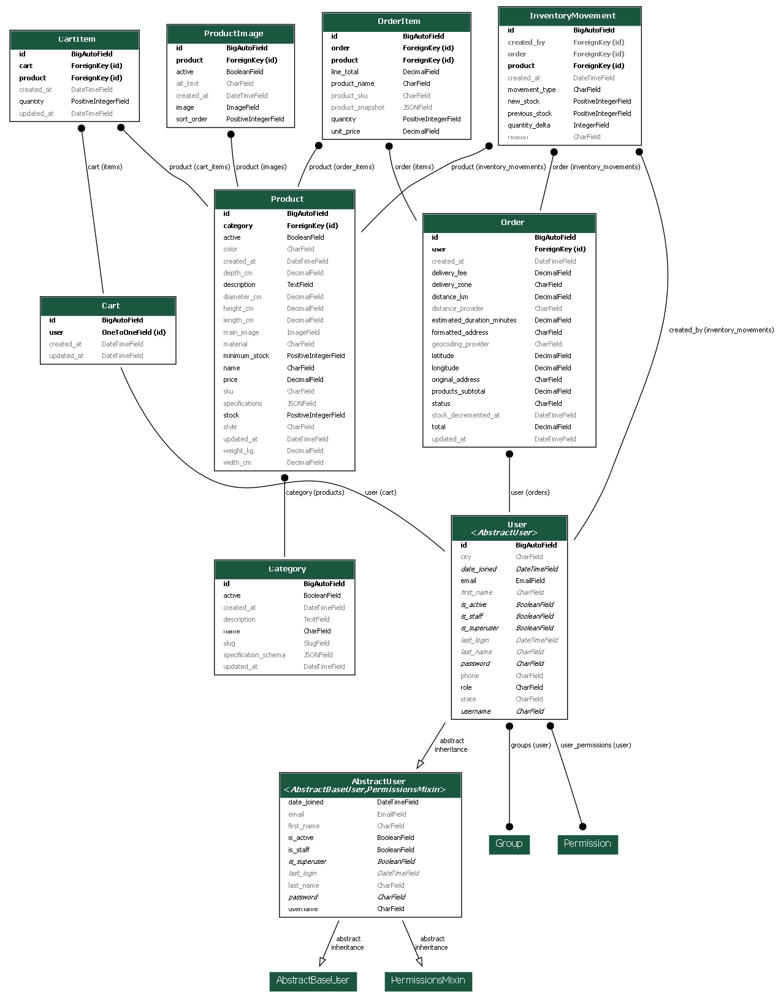
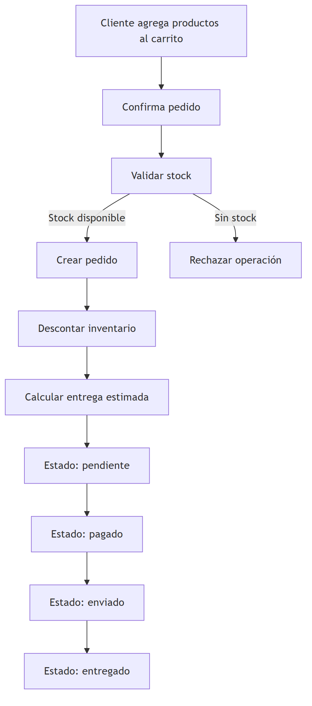

# Documentación del backend

Esta carpeta contiene documentación técnica del backend de Daybed, incluyendo diagramas del sistema y el contrato OpenAPI de la API REST.

## Arquitectura general del backend


El backend está organizado en módulos funcionales: autenticación, cuentas de usuario, catálogo, carrito, pedidos, inventario, entregas y dashboard administrativo. Esta separación permite mantener responsabilidades claras entre las partes principales del sistema.

## Diagrama entidad-relación



El diagrama entidad-relación fue generado a partir de los modelos definidos en Django. Representa el diseño lógico de entidades y relaciones utilizadas por el backend.

## Flujo del pedido



Este flujo representa el proceso principal de negocio: el cliente agrega productos al carrito, confirma el pedido, el sistema valida el stock, crea el pedido y actualiza el inventario.

## Contrato OpenAPI

El archivo [`openapi.yaml`](./openapi.yaml) contiene la especificación OpenAPI generada desde Django REST Framework. Esta especificación documenta los endpoints, métodos HTTP, esquemas de entrada, respuestas y autenticación de la API.

## Archivos incluidos

```text
docs/backend/
  openapi.yaml
  diagrams/
    arquitectura_backend.mmd
    arquitectura_backend.png
    diagrama_erd_backend.png
    flujo_pedido.mmd
    flujo_pedido.png
    
## Cobertura de pruebas

La cobertura de pruebas se puede generar localmente con:

```bash
cd backend
uv run coverage erase
uv run coverage run -m pytest
uv run coverage report
uv run coverage html
